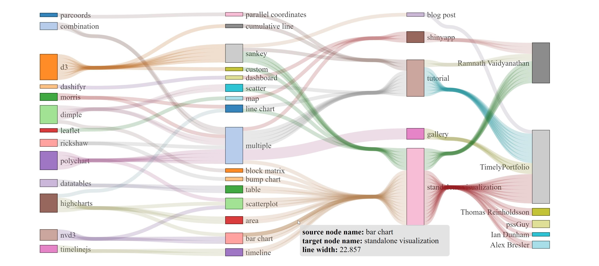

# NeatSankey: Sankey Diagrams with Improved Readability Based on Node Positioning and Edge Bundling

# NeatSankey's extra supp-materials introduction

- folder `EX - NeatSankey Charts`: this folder contains the charts that using extreme datasets which used to prove the scalability of our algorithm
- folder `attachment`: this folder contains two more folder. One named `extra_attachment` contains the new generated NeatSankey charts without edge bundling algorithm and both the sugiyama and ilp charts with edge bundling algorithm. The other one named `original_attachment` contains the charts which we used before.
- folder `fig11 - improve`: this folder contains improved fig11 with different versions and a dataset analysis file
- folder `fig12 - improve`: this folder contains improved fig12 with its source html file and final svg files
- folder `User_Study_Data`: this folder contains the data that we collected in our `User Study`.
- folder `User_Study_Web`: this folder contains the website which we used for collecting the data in our `User Study`.
- file `supp.pdf`: To easily compare different methods and furtherly present the work we had down, we put more details here including more layout results, metrics and so on.
- file `supp.jpg`: Our headline image.
